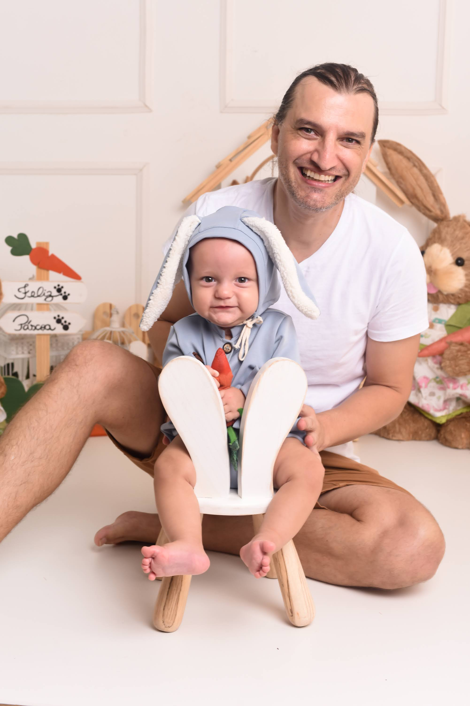

---js
{
  eleventyNavigation: {
    key: "About",
    order: 1
  },
  permalink: "/",
  title: "About Anselmo Luiz Éden Battisti",
  description: "Anselmo Luiz Éden Battisti has a PhD in Computer Science specializing in IoT, Edge Computing, and Virtual Network Functions (VNFs), bridging academic research and real-world innovation."
}
---

# Anselmo Luiz Éden Battisti

  

    
    

      Anselmo e Oliver
    

  

  

    
I’m <strong>Anselmo Luiz Éden Battisti</strong>, <strong>PhD in Computer Science from Fluminense Federal University (UFF)</strong>, with research focused on Internet of Things (IoT), Edge Computing, and Virtual Network Functions (VNFs). My academic background also includes a <strong>Master’s in Computer Science (UFF)</strong>, a <strong>Master’s in Strategic Management (PUCPR)</strong>, a specialization in Java Development (Unioeste), and a <strong>Bachelor’s in Computer Science (Unioeste)</strong>.

  

  
  
I have worked as a project manager and professor for two decades, contributing to innovation-driven initiatives and participating in national and international projects in areas such as 5G, smart cities and digital platforms. These efforts resulted in scientific publications, patents registered in the United States and market-applied solutions. 

  
As one of the founders of <a target="_blank" href="https://webgenium.com.br/"><strong>Webgenium</strong></a>, I have continued this journey by driving digital innovation and creating solutions that support businesses in their transformation processes, combining hands-on experience in web and digital projects with a broader vision of how technology can generate meaningful impact. This path has allowed me to bridge academic research with real-world applications, reinforcing my commitment to turning knowledge into practical, smart and effective solutions.

