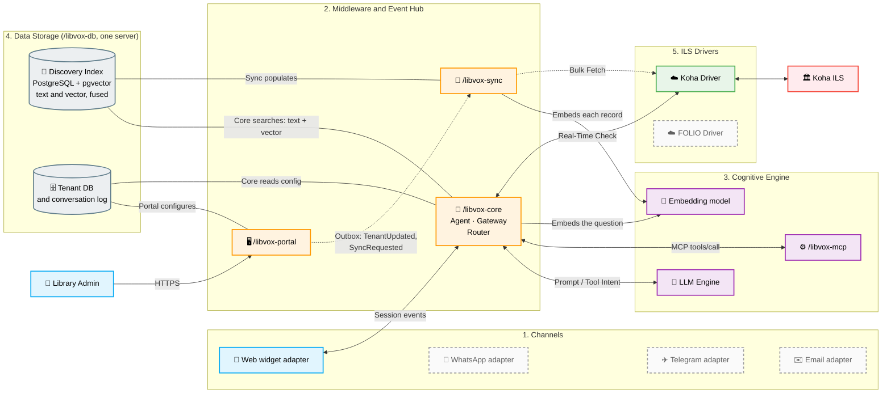

Developed as an applied research initiative, LibVox does not seek to modify or
replace existing ILS deployments. Instead, it provides a scalable, multi-tenant
SaaS middleware that translates natural language questions into structured API
queries, serving heavy metadata from a locally indexed copy while retrieving
real-time availability from the ILS itself.

The LibVox architecture: channels, middleware and event hub, cognitive engine, data storage and ILS drivers.

